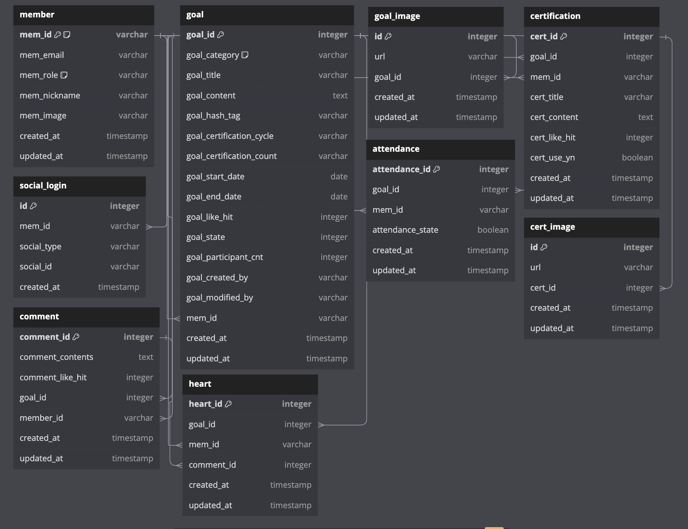

### DBML 스키마 정의

[스키마 정의](https://dbdiagram.io/d/the-codee-666e6531a179551be6fb889f)

```dbml
// Use DBML to define your database structure
// Docs: https://dbml.dbdiagram.io/docs

Table member {
  mem_id varchar [primary key, note: 'UUID']
  mem_email varchar
  mem_role varchar [note: 'ENUM: MemRole (e.g., ROLE_USER)']
  mem_nickname varchar
  mem_image varchar
  created_at timestamp
  updated_at timestamp
}

Table social_login {
  id integer [primary key, increment]
  mem_id varchar
  social_type varchar
  social_id varchar
  created_at timestamp
}

Table attendance {
  attendance_id integer [primary key, increment]
  goal_id integer
  mem_id varchar
  attendance_state boolean
  created_at timestamp
  updated_at timestamp
}

Table certification {
  cert_id integer [primary key, increment]
  goal_id integer
  mem_id varchar
  cert_title varchar
  cert_content text
  cert_like_hit integer
  cert_use_yn boolean
  created_at timestamp
  updated_at timestamp
}

Table cert_image {
  id integer [primary key, increment]
  url varchar
  cert_id integer
  created_at timestamp
  updated_at timestamp
}

Table comment {
  comment_id integer [primary key, increment]
  comment_contents text
  comment_like_hit integer
  goal_id integer
  member_id varchar
  created_at timestamp
  updated_at timestamp
}

Table goal {
  goal_id integer [primary key, increment]
  goal_category varchar [note: 'ENUM: Category (e.g., WORKOUT, LEARNING)']
  goal_title varchar
  goal_content text
  goal_hash_tag varchar
  goal_certification_cycle varchar
  goal_certification_count varchar
  goal_start_date date
  goal_end_date date
  goal_like_hit integer
  goal_state integer
  goal_participant_cnt integer
  goal_created_by varchar
  goal_modified_by varchar
  mem_id varchar
  created_at timestamp
  updated_at timestamp
}

Table goal_image {
  id integer [primary key, increment]
  url varchar
  goal_id integer
  created_at timestamp
  updated_at timestamp
}

Table heart {
  heart_id integer [primary key, increment]
  goal_id integer
  mem_id varchar
  comment_id integer
  created_at timestamp
  updated_at timestamp
}

Enum Category {
  ALL
  WORKOUT
  LEARNING
  READING
  LIFESTYLEHABBITS
  HOBBY
  FINANCE
}

Enum MemRole {
  ROLE_USER
  MANAGEMENT
}

Enum SocialCode {
  NAVER
}

Ref: social_login.mem_id > member.mem_id // many-to-one
Ref: attendance.goal_id > goal.goal_id // many-to-one
Ref: attendance.mem_id > member.mem_id // many-to-one
Ref: certification.goal_id > goal.goal_id // many-to-one
Ref: certification.mem_id > member.mem_id // many-to-one
Ref: cert_image.cert_id > certification.cert_id // many-to-one
Ref: comment.goal_id > goal.goal_id // many-to-one
Ref: comment.member_id > member.mem_id // many-to-one
Ref: goal.mem_id > member.mem_id // many-to-one
Ref: goal_image.goal_id > goal.goal_id // many-to-one
Ref: heart.goal_id > goal.goal_id // many-to-one
Ref: heart.mem_id > member.mem_id // many-to-one
Ref: heart.comment_id > comment.comment_id // many-to-one
```

### 설명

- **Tables**:
  - `member`: 회원 정보를 저장하는 테이블.
  - `social_login`: 소셜 로그인 정보를 저장하는 테이블.
  - `attendance`: 출석 정보를 저장하는 테이블.
  - `certification`: 인증 정보를 저장하는 테이블.
  - `cert_image`: 인증 이미지 정보를 저장하는 테이블.
  - `comment`: 댓글 정보를 저장하는 테이블.
  - `goal`: 목표 정보를 저장하는 테이블.
  - `goal_image`: 목표 이미지 정보를 저장하는 테이블.
  - `heart`: 좋아요 정보를 저장하는 테이블.

- **Enums**:
  - `Category`: 목표의 카테고리를 나타내는 열거형.
  - `MemRole`: 회원의 역할을 나타내는 열거형.
  - `SocialCode`: 소셜 로그인 유형을 나타내는 열거형.

- **References**:
  - 각 테이블 간의 관계를 정의합니다. 예를 들어, `social_login.mem_id`는 `member.mem_id`를 참조하는 다대일 관계입니다.

이 스키마는 주어진 엔티티 클래스를 바탕으로 데이터베이스 테이블과 그 관계를 정의합니다.