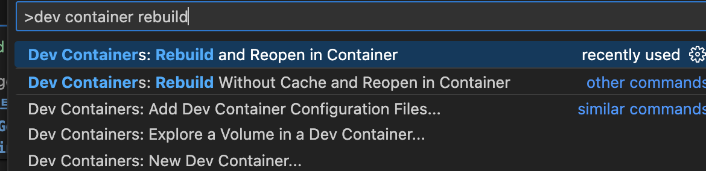

## 프로젝트 설정

이 포스트에서는 Golang 개발 환경에서 PostgreSQL을 사용하는 방법을 단계별로 설명합니다. Dockerfile, Docker Compose, .devcontainer 설정, .env 파일 생성 등을 포함하여 PostgreSQL 컨테이너를 설정하는 과정을 다룹니다.

### 1. 프로젝트 구조 설정

먼저, 프로젝트 디렉토리 구조를 설정합니다. 다음과 같은 구조를 사용합니다:

```
project-root/
│
├── .devcontainer/
│   ├── devcontainer.json
│   ├── Dockerfile
│   └── postpre/
│       ├── Dockerfile
│       └── init.sql
│
├── .env
├── .gitignore
├── docker-compose.yml
├── go.mod
├── go.sum
├── main.go
└── README.md
```

### 2. PostgreSQL Dockerfile 추가

`.devcontainer/postpre` 디렉토리에 PostgreSQL을 위한 Dockerfile을 작성합니다. 이 파일은 PostgreSQL 이미지와 초기화 스크립트를 설정합니다.

#### .devcontainer/postpre/Dockerfile

```dockerfile
# PostgreSQL 이미지를 기반으로 합니다.
FROM postgres:14

# 데이터베이스 초기화 스크립트 복사
COPY init.sql /docker-entrypoint-initdb.d/
```

#### .devcontainer/postpre/init.sql

`init.sql` 파일을 작성하여 초기 데이터베이스 스키마와 데이터를 설정합니다.

```sql
-- 사용자 테이블 생성
CREATE TABLE users (
    id SERIAL PRIMARY KEY,
    username VARCHAR(50) NOT NULL UNIQUE,
    email VARCHAR(100) NOT NULL UNIQUE,
    password VARCHAR(100) NOT NULL,
    created_at TIMESTAMP DEFAULT CURRENT_TIMESTAMP,
    updated_at TIMESTAMP DEFAULT CURRENT_TIMESTAMP,
    last_login TIMESTAMP,
    auth_token VARCHAR(100),
    is_active BOOLEAN DEFAULT TRUE
);

-- 초기 데이터 삽입
INSERT INTO users (username, email, password, last_login, auth_token, is_active) VALUES
('testuser1', 'testuser1@example.com', 'password1', NOW(), 'token1', TRUE),
('testuser2', 'testuser2@example.com', 'password2', NOW(), 'token2', TRUE);
```

### 3. .env 파일 생성

프로젝트 루트 디렉토리에 `.env` 파일을 생성하여 환경 변수를 설정합니다. 이 파일은 PostgreSQL과 애플리케이션 간의 환경 변수를 정의합니다. 또한, `.env` 파일에서 환경 변수 키 이름이 정해진 이유는 PostgreSQL Docker 이미지에서 표준으로 사용되는 변수 이름이기 때문입니다.

#### .env 파일

```env
# PostgreSQL 컨테이너 초기화에 사용되는 환경 변수
POSTGRES_USER=<username>
POSTGRES_PASSWORD=<password>
POSTGRES_DB=<database_name>

# 애플리케이션이 데이터베이스에 접속할 때 사용하는 환경 변수
DB_HOST=db
DB_USER=<username>
DB_PASSWORD=<password>
DB_NAME=<database_name>
```

### 환경 변수 키 설명

- **POSTGRES_USER**: PostgreSQL 컨테이너가 초기화될 때 데이터베이스 슈퍼유저의 이름을 설정합니다.
- **POSTGRES_PASSWORD**: PostgreSQL 컨테이너가 초기화될 때 데이터베이스 슈퍼유저의 비밀번호를 설정합니다.
- **POSTGRES_DB**: PostgreSQL 컨테이너가 초기화될 때 생성할 데이터베이스의 이름을 설정합니다.
- **DB_HOST**: 애플리케이션이 연결할 데이터베이스의 호스트 이름을 설정합니다. 여기서 `db`는 Docker Compose에서 정의된 PostgreSQL 서비스의 이름입니다.
- **DB_USER**: 애플리케이션이 연결할 데이터베이스의 사용자 이름을 설정합니다.
- **DB_PASSWORD**: 애플리케이션이 연결할 데이터베이스의 사용자 비밀번호를 설정합니다.
- **DB_NAME**: 애플리케이션이 연결할 데이터베이스의 이름을 설정합니다.

### 4. .gitignore 파일 수정

`.env` 파일을 버전 관리 시스템에 포함하지 않도록 `.gitignore` 파일에 추가합니다.

#### .gitignore 파일

```gitignore
.env
```

### 5. Docker Compose 파일 추가

`docker-compose.yml` 파일을 작성하여 Golang과 PostgreSQL 컨테이너를 설정합니다.

#### docker-compose.yml

```yaml
version: '3.8'

services:
  golang:
    build:
      context: .
      dockerfile: .devcontainer/Dockerfile
    volumes:
      - .:/workspace
    ports:
      - "8080:8080"
    depends_on:
      - db
    env_file:
      - .env

  db:
    build:
      context: .devcontainer/postpre
      dockerfile: Dockerfile
    ports:
      - "5432:5432"
    volumes:
      - postgres-data:/var/lib/postgresql/data
    env_file:
      - .env

volumes:
  postgres-data:
```

#### 서비스 이름과 네트워크

`db`는 PostgreSQL 서비스의 이름입니다. Docker Compose는 각 서비스에 대해 기본 네트워크를 생성하고, 각 서비스는 이 네트워크 내에서 이름을 사용하여 서로 통신할 수 있습니다. `DB_HOST=db`는 Golang 애플리케이션이 이 네트워크 내에서 PostgreSQL 서비스에 연결할 수 있도록 합니다.

### 6. .devcontainer 설정 변경

`devcontainer.json` 파일을 수정하여 Docker Compose를 사용하도록 설정합니다.

#### .devcontainer/devcontainer.json

```json
{
    "name": "Golang Dev Container",
    "dockerComposeFile": "docker-compose.yml",
    "service": "golang",
    "workspaceFolder": "/workspace",
    "customizations": {
        "vscode": {
            "extensions": [
                "golang.go",
                "mhutchie.git-graph",
                "eamodio.gitlens",
                "esbenp.prettier-vscode",
                "ms-azuretools.vscode-docker",
                "shardulm94.trailing-spaces",
                "ybaumes.highlight-trailing-white-spaces",
                "github.vscode-pull-request-github"
            ],
            "settings": {
                "terminal.integrated.defaultProfile.linux": "bash",
                "terminal.integrated.profiles.linux": {
                    "bash": {
                        "path": "/usr/bin/bash"
                    }
                },
                "go.toolsManagement.autoUpdate": true,
                "go.lintTool": "golangci-lint",
                "go.lintFlags": [
                    "--fast"
                ],
                "go.formatTool": "goimports",
                "editor.formatOnSave": true,
                "[go]": {
                    "editor.formatOnSave": true,
                    "editor.codeActionsOnSave": {
                        "source.organizeImports": "always",
                        "source.fixAll": "always"
                    }
                },
                "git.safe.directory": "/workspace"
            }
        }
    },
    "postCreateCommand": "(if [ ! -f go.mod ]; then go mod init github.com/<username>/projectname; fi) && go mod tidy && git config --global --add safe.directory /workspace",
    "remoteUser": "vscode",
    "mounts": [
        "source=${localWorkspaceFolder}/,target=/workspace,type=bind,consistency=cached"
    ]
}
```

### 7. Golang 코드 수정

Golang 코드에서 환경 변수를 사용하여 PostgreSQL 데이터베이스에 연결합니다.

#### main.go

```go
package main

import (
	"database/sql"
	"fmt"
	"log"
	"os"

	_ "github.com/lib/pq"
)

func main() {
	// 환경 변수에서 데이터베이스 연결 정보 가져오기
	dbHost := os.Getenv("DB_HOST")
	dbUser := os.Getenv("DB_USER")
	dbPassword := os.Getenv("DB_PASSWORD")
	dbName := os.Getenv("DB_NAME")

	// 환경 변수 출력 (디버깅 목적)
	fmt.Printf("host=%s user=%s password=%s dbname=%s sslmode=disable\n",
		dbHost, dbUser, dbPassword, dbName)

	// 데이터베이스 연결 문자열 구성
	connStr := fmt.Sprintf("host=%s user=%s password=%s dbname=%s sslmode=disable",
		dbHost, dbUser, dbPassword, dbName)

	// 데이터베이스 연결
	db, err := sql.Open("postgres", connStr)
	if err != nil {
		log.Fatal(err)
	}
	defer db.Close()

	// 연결 확인
	err = db.Ping()
	if err != nil {
		log.Fatal(err)
	}
	fmt.Println("Successfully connected to the database!")

	// 간단한 쿼리 실행 (users 테이블 조회)
	rows, err := db.Query("SELECT id, username, email, created_at, last_login FROM users")
	if err != nil {
		log.Fatal(err)
	}
	defer rows.Close()

	// 조회 결과 출력
	for rows.Next() {
		var id int
		var username, email string
		var createdAt, lastLogin sql.NullTime
		err := rows.Scan(&id, &username, &email, &createdAt, &lastLogin)
		if err != nil {
			log.Fatal(err)
		}
		fmt.Printf("ID: %d, Username: %s, Email: %s, CreatedAt: %v, LastLogin: %v\n",
			id, username, email, createdAt, lastLogin)
	}

	// 에러 확인
	err = rows.Err()
	if err

 != nil {
		log.Fatal(err)
	}
}
```

### 8. 전체 재빌드 및 실행

Visual Studio Code에서 Dev Container를 재빌드하고 실행합니다.


- Without Cache를 선택합닏다.


### 수동으로 재빌드 및 실행

Visual Studio Code 명령어를 사용할 수 없는 경우, 터미널에서 다음 명령어를 사용하여 수동으로 컨테이너를 재빌드하고 실행할 수 있습니다:

#### 모든 컨테이너와 네트워크 종료 및 삭제

```bash
docker-compose down -v
```

#### 사용하지 않는 모든 이미지 삭제

```bash
docker image prune -a
```

#### 새 이미지를 빌드하고 컨테이너 실행

```bash
docker-compose up --build
```

### 결론

이 포스트에서는 Golang 개발 환경에서 PostgreSQL을 사용하는 방법을 살펴보았습니다. Dockerfile, Docker Compose, .devcontainer 설정, .env 파일 생성 등을 통해 PostgreSQL 컨테이너를 설정하고 Golang 애플리케이션에서 데이터베이스에 연결하는 방법을 단계별로 설명했습니다.