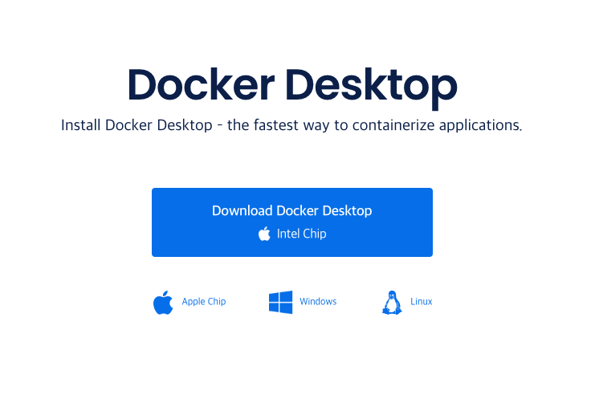
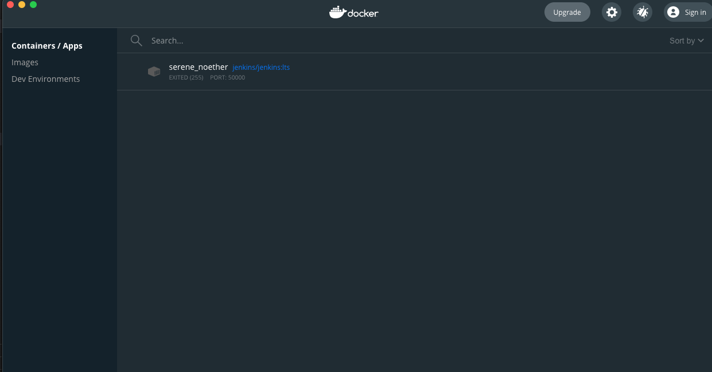
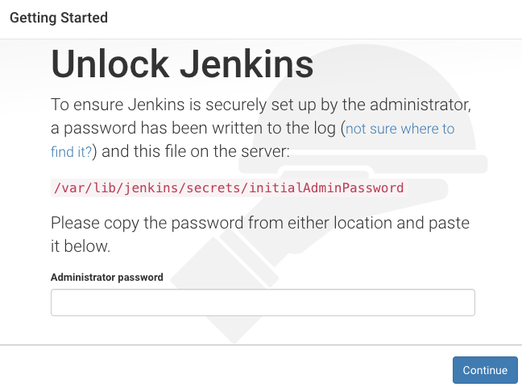
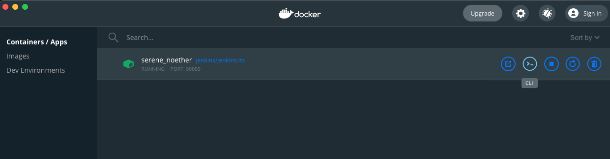
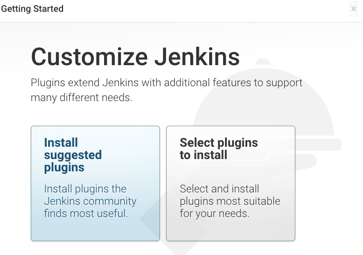
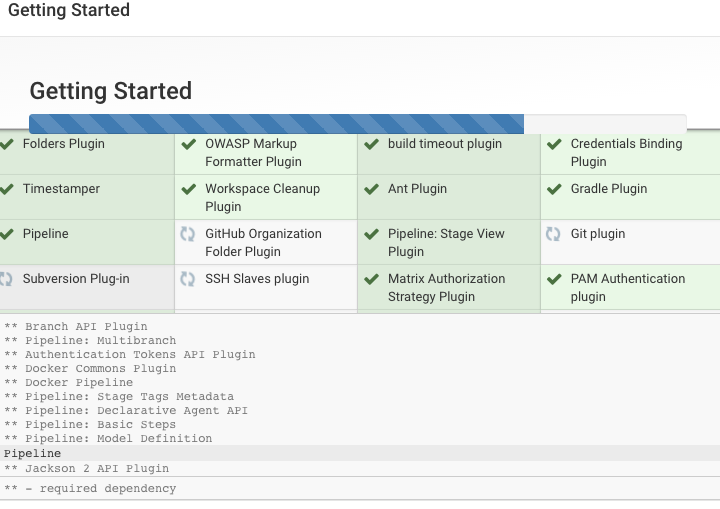
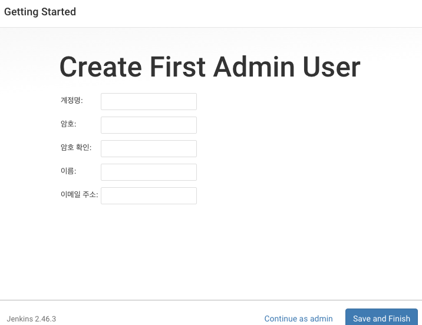
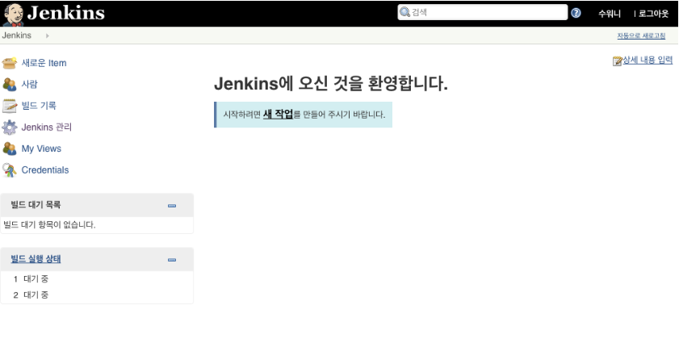

# Jenkins

## Jenkins란?

Jenkins는 지속적인 통합 및 지속적인 배포(CI/CD)를 지원하는 오픈 소스 자동화 도구입니다.
Jenkins는 다음과 같은 특징을 가지고 있습니다.

1. 유연성: Jenkins는 다양한 플러그인을 통해 다른 CI/CD 도구와 연동이 가능하며 다양한 언어와 프레임 워크를 지원합니다.
2. 오픈소스: 오픈소스로 무료로 사용할 수 있습니다.
3. 높은안정성: 다양한 소스 코드 버전 관리 시스템과 통합할 수 있으며 다양한 플러그인을 통해 다양한 통합 기능을 제공합니다.
4. 사용시 별도 서버가 필요합니다.
5. 동기적으로 처리되어 배포시 상대적으로 오랜 시간이 소요 됩니다.

## 사용법

이번 설치는 mac os에 docker를 설치하여 docker를 통해 jenkins를 설치 하였습니다.

### docker 설치

1. Docker Desktop for Mac 다운로드: https://www.docker.com/products/docker-desktop 에서 Docker Desktop for Mac을 다운로드하고 설치합니다.



2. 설치 파일 실행: Docker Desktop 설치 파일을 다운로드한 후, .dmg 파일을 더블 클릭하여 설치 파일을 실행합니다.
   <br>
3. 설치 파일 드래그 앤 드랍: 설치 파일을 열면 Docker Desktop을 Applications 폴더에 드래그 앤 드랍하여 설치합니다.
   <br>
4. Docker 실행: 설치가 완료되면 Docker Desktop을 실행합니다.

### jenkins 설치

1. jenkins 이미지를 받습니다.
   ```Ruby
   docker pull jenkins/jenkins:lts
   ```
2. container를 실행합니다.
   ```Ruby
   docker run -d -p 8080:8080 -p 50000:50000 -v jenkins_home:/var/jenkins_home jenkins/jenkins:lts
   ```
3. 생성된 컨테이너를 확인합니다.
   

4. https://localhost:8080 접속합니다.

5. 처음 로그인 하게 되면 initPassword를 입력해야 합니다.
   아래 이미지 처럼 해당 경로에서 확인 할 수 있습니다.

   

   저는 docker를 통해 설치 했기 때문에 docker container 내부로 접속 후 확인 하였습니다.
   

6. jenkins에서 사용할 plugins 설치 화면 입니다.
   좌측 `Install suggested plugins`을 클릭합니다.
   

7. plugins 설치 화면입니다.
   한번에 설치 되지 않는 경우 Retry를 통해 모두 설치 해줍니다.
   

8. 로그인 계정을 생성합니다.
   

9. 설치가 모두 완료 되었습니다. 다음으로는 github와 연동 방법에 대해서 설명하도록 하겠습니다.
   
